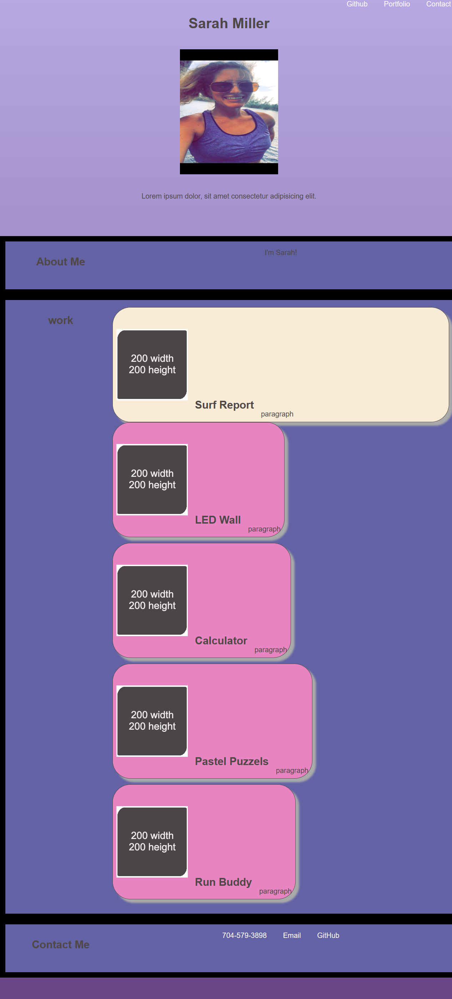

# Sarah-Miller-Portfolio

This personal portfolio is a good starting point where I will be able to upload projects that we do throughout the class. I learned so much by doing this project. Visually it is definitly not how I would like it to be but I can continue to edit and modify it over the next several months as I continue to imrove and learn new skills. 

URL of the deployed application:

https://smiller422.github.io/Sarah-Miller-Portfolio/

